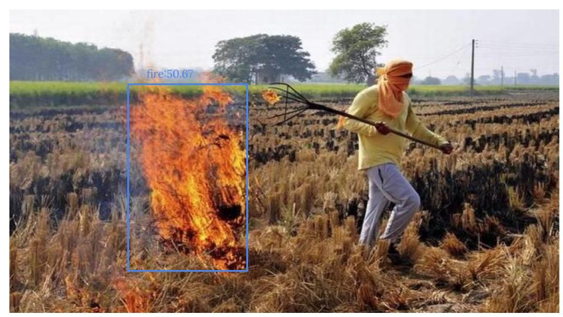

# NEC-Hack2020-AgriTech
The news papers were full of articles about northern India especially Delhi falling below the moderate air quality index.
The neglect of burning and poor maintenance of crop residue from the farms causes the smoke that leads to heavy air pollution .
2.2 million children in Delhi have irreversible lung damage due to the poor quality of the air. In addition, research shows that pollution can lower children's immune system and increase the risks of cancer, epilepsy, diabetes.

# Android app :

https://github.com/rachanac11/AgriTech

# Website

A website designed to automate stubble pickup from farmers. After ensuring that farmers do not burn the stubble, we sought to pickup this stubble from them and transport it to recycling industries. Key features include 3 logins and signups namely for the Admin,delivery boy and farmer, free call for pickup,Otp verification through mail, Chatbot for convenience, Admin's control over all placed orders, Delivery boy's ability to update the status of orders.

# Fire Detection Module

link for datasets : https://people.csail.mit.edu/torralba/code/spatialenvelope/spatial_envelope_256x256_static_8outdoorcategories.zip
https://drive.google.com/file/d/11KBgD_W2yOxhJnUMiyBkBzXDPXhVmvCt/view?usp=sharing

